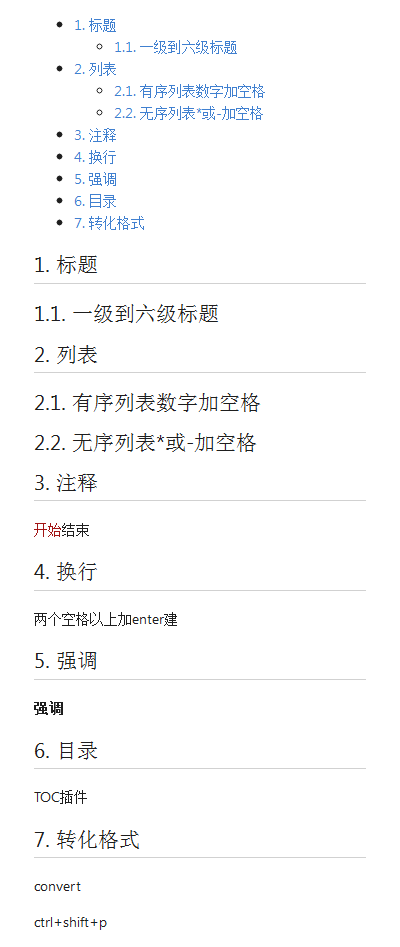

<!-- TOC -->

- [1. 标题](#1-标题)
    - [1.1. 一级到六级标题](#11-一级到六级标题)
- [2. 列表](#2-列表)
    - [2.1. 有序列表数字加空格](#21-有序列表数字加空格)
    - [2.2. 无序列表*或-加空格](#22-无序列表或-加空格)
- [3. 注释](#3-注释)
- [4. 换行](#4-换行)
- [5. 强调](#5-强调)
- [6. 目录](#6-目录)
- [7. 转化格式](#7-转化格式)

<!-- /TOC -->
# 1. 标题
## 1.1. 一级到六级标题
# 2. 列表
## 2.1. 有序列表数字加空格
## 2.2. 无序列表*或-加空格
# 3. 注释
 ```开始```结束
# 4. 换行
两个空格以上加enter建
# 5. 强调
*强调*  
**强调**
# 6. 目录
TOC插件
# 7. 转化格式
convert   

ctrl+shift+p


