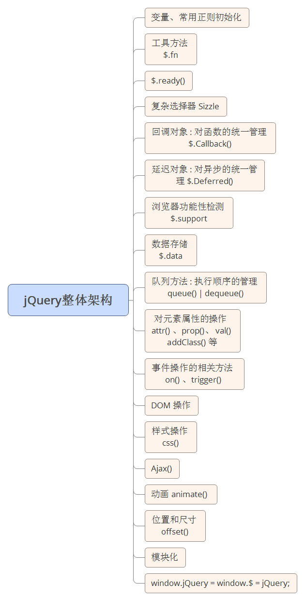

# jQuery

## 引号问题
	$("选择器")  
注意引号不能丢！！在jQuery世界中，只有三个东西不能加引号，其他必须加引号：  
	$(this)  
	$(document)  
	$(window)

## 筛选器
```$("p") 			所有的p  
$("p:first")  	第一个p  
$("p:last")	最后一个p  
$("p:eq(3)")	下标为3的p  
$("p:lt(3)")	下标小于3的p  
$("p:gt(3)")	下标大于3的p  
$("p:odd")		下标是奇数的p  
$("p:even")	下标是偶数的p  
```  

## css函数
读样式，可以读取计算后样式，写一个参数，是不是驼峰，无所谓，但是必须加引号：  
	$("p:first").css("background-color");  
	$("p:first").css("backgroundColor");  

设置样式，设置样式，有两种语法，如果你只想设置一个样式，逗号隔开k和v：  
	$("p:odd").css("backgroundColor","blue");  

如果想设置很多样式，就写JSON:  
所有的数值，不需要单位：  
	$("p:lt(4)").css({  
		"width" : 20,  
		"height" : 20,   
		"backgroundColor" : "red"  
	})
特别的，还支持+=写法：   
	$("p:eq(5)").css("width","+=20px");   

## animate函数
和我们封装的框架不一样，jQuery默认有一个处理机制，叫做动画排队。当一个元素接收到了两个animate命令之后，后面的animate会排队：  

	$("p").animate({"left":1000},2000);  
	$("p").animate({"top":400},2000); 
	先2000毫秒横着跑，然后2000毫秒竖着跑。动画总时长4000。  

如果想让元素斜着跑，就是同时变化left和top，就写在同一个JSON里面.  
不同的元素，不排队，是同时的。  

## 事件监听  
	$(".box1").click(function(){  
		//点击box1之后做的事情  
	});  
事件名一律不写on。特别的，鼠标进入改成了mouseenter，鼠标离开改为了mouseleave。  

##jQuery实现  

### 拖拽
需要额外导入jquery UI包   
Draggable：拖拽  
Droppable ：拖放  
Resizable ：改变尺寸  
Selectable ：可选择  
Sortable ：可排序  

	$("p").draggable({
	axis: "x",		 //约束在某个轴上
	containment: "parent",	//在父盒子中拖拽
	grid : [100],			//步长
	drag : function(event, ui){  //事件，值就是ui.position.top
		console.log(ui.position.left,ui.position.top);
	}
});

## 各种尺寸
	$("div").width();  //计算后的内容宽度  
	$("div").innerWidth();  //计算后的算上padding的宽度  
	$("div").outerWidth();  //算上padding和border  
	$("div").outerWidth(true);//算上padding和border和margin 

## 净位置

就是我们昨天封装的getAllTop，jQuery中也替我们封装了。叫做offset()这个方法返回一个带有top、left、bottom、right属性的对象。  
	var t = $("p").offset().top;  
	跟之前学的getAllTop有点像

## 鼠标滚轮事件
另下插件  

	$("div").mousewheel(function(event){  
	if(event.preventDefault){  
		event.preventDefault();  
	}else{  
	event.returnValue = false;  
	}  
	$("div").html(event.deltaY);  
	}); 

