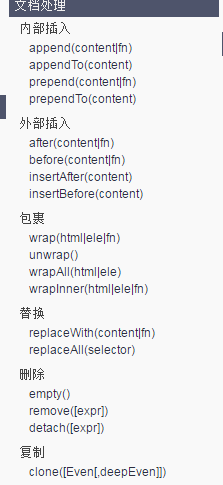

# jquery 

## 序与迭代

### eq()方法
与index(),lt、gt、odd、even、first、last相同序列号  
都是从父元素下的子元素开始计算，不同父元素从0开始重新计算  

### index()
返回这个元素在亲兄弟中的排名，无视选择器怎么选。

### each()
each()表示遍历节点，也叫作迭代符合条件的节点。
``` $("p").each(function(i){
        $(this).animate({"width":50 * i},1000);
    });
```
each()方法中自带序列号i  

### size()方法 
与.length属性相同 

## get()
与eq()的序列号相同，get()获得的是js原生对象，eq()获得的是jq对象.   
   $("p").eq(2).html("哈哈哈哈哈哈");
等价于：
   $("p").get(2).innerHTML = "哈哈哈哈哈哈";
等价于：
   $("p").eq(2)[0].innerHTML = "哈哈哈哈哈哈";

## 动画相关

### 内置 show(),hide(),toggle()方法 
show()显示、hide()隐藏、toggle()切换

   $("div").show();        //让一个本身是display:none;元素显示
   $("div").hide();        //隐藏元素display:none;
   $("div").toggle();      //切换显示状态。

特别的，如果show()、hide()、toggle()里面有数值，将变为动画：
1  $("div").show(1000);
效果：此时display:none;的元素，将从左上角徐徐展开。动画机理：
这个display:none;的元素会变为显示的，然后瞬间将宽度、高度、opacity设为0，然后徐徐展开。  
   $("div").show([时间],[回调函数]);

### slideDown()、slideUp()、slideToggle()方法
slideDown : 下滑展开  
slideUp：上滑收回  
slideToggle : 滑动切换  

## 节点关系

### 节点类型值
任何的HTML元素，都有nodeType属性，值有1~11   
1：	元素节点   
3：	文本节点   
8：	注释节点   
9：	document节点   
10:	DTD   

### 原生js中的childNodes  
  
注意，这里有重大兼容性问题：  
  
	<div id="box">  
		<p></p>  
	</div>  
Chrome、IE9、IE10……高级浏览器，认为：  
	box.childNodes[0].nodeType   //3  
高级浏览器认为box的大儿子是文本节点。当然是空文本。  
   
IE6、7、8认为：  
	box.childNodes[0].nodeType   //1  
IE6、7、8认为box的大儿子是p。  


怎么解决这个差异呢？放弃原有的数组，重新遍历儿子数组，把所有nodeType为1的元素组成一个新的数组  
	 var childs = [];
	 for(var i = 0 ; i < box.childNodes.length ; i++){
		if(box.childNodes[i].nodeType == 1){
			childs.push(box.childNodes[i]);
		}  
	 }  
	 childs[1].style.background = "red";  

firstChild属性、lastChild属性：也不好用，IE6、7、8认为firstChild是节点，而Chrome认为firstChild是空文本

### 原生js中parentNode只有一个

### previousSibing\nextSibing
上一个同胞兄弟，下一个同胞兄弟。  
同样有上述的兼容问题  

### children()方法
所有亲儿子节点。就是儿子，孙子不在children()里面。

jQuey屏蔽掉了浏览器兼容问题，不存在空文本节点也是儿子了，事实上children()返回的只能是节点，所有的文本都不算做是儿子了。  
### find()方法
所有后代元素。和children()不一样，children()返回的是自己的亲儿子元素列表，而find()返回的是自己的后代所有元素的列表。  

### parent()方法
任何元素都只有一个亲爸爸。

### parents()方法
寻找祖先元素集合  

### siblings()方法
寻找亲兄弟集合   
可以加选择器、筛选器：
	$(".xiaoming").siblings(":odd").css("background-color","red");

排他，妈妈再也不用担心我写for循环了：
	$(this).addClass("cur").siblings().removeClass("cur");
我加cur，我的兄弟们去cur。


### prev()、next()、prevAll()、nextAll()

前一个兄弟、后一个兄弟、前所有兄弟、后所有兄弟。

### 增删改节点

