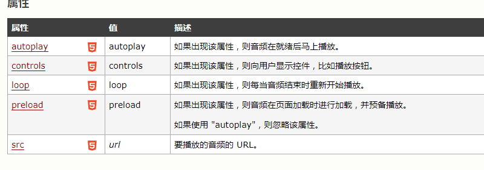
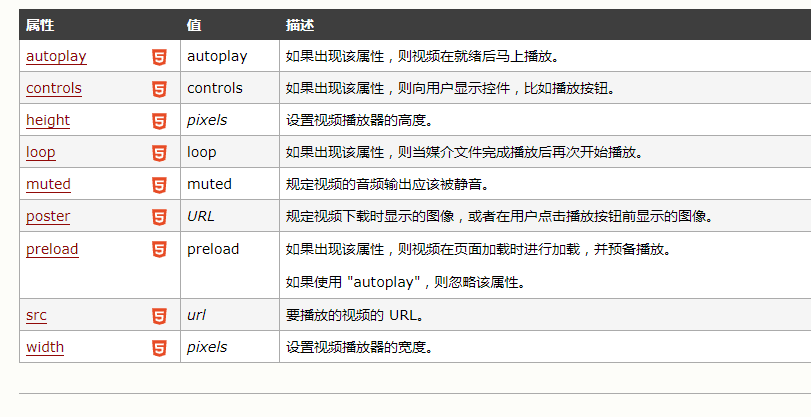

内容参考https://developer.mozilla.org/zh-CN/docs/Web/Guide/HTML/HTML5

# 语义
能够让你更恰当地描述你的内容是什么。  

# 连通性
能够让你和服务器之间通过创新的新技术方法进行通信。  

# 离线&存储
能够让网页在客户端本地存储数据以及更高效地离线运行。  

# 多媒体
使 video 和 audio 成为了在所有 Web 中的一等公民。  

# 2D/3D 绘图 & 效果 
提供了一个更加分化范围的呈现选择。  

# 性能 & 集成
提供了非常显著的性能优化和更有效的计算机硬件使用。  

# 设备访问 Device Access
能够处理各种输入和输出设备。

# 音频属性

# 视频属性

#input 中的新属性
## autocomplete	
on  off  
规定是否使用输入字段的自动完成功能。  

## autofocus
autofocus	  
规定输入字段在页面加载时是否获得焦点。（不适用于 type="hidden"）  

## height	width
pixels%  
定义 input 字段的高度，宽度（适用于 type="image"）

## list	
datalist-id	
引用包含输入字段的预定义选项的 datalist 。

## max	min
number date  
规定输入字段的最大值。  
请与 "min" 属性配合使用，来创建合法值的范围。  

## step
number  
规定输入字的的合法数字间隔。

## maxlength	
number	
规定输入字段中的字符的最大长度。  

## multiple	
multiple	
如果使用该属性，则允许一个以上的值。

## pattern	
regexp_pattern	
规定输入字段的值的模式或格式。
例如 pattern="[0-9]" 表示输入值必须是 0 与 9 之间的数字。
placeholder	text	规定帮助用户填写输入字段的提示。
##readonly	
readonly	
规定输入字段为只读。

##required	
required	
指示输入字段的值是必需的。