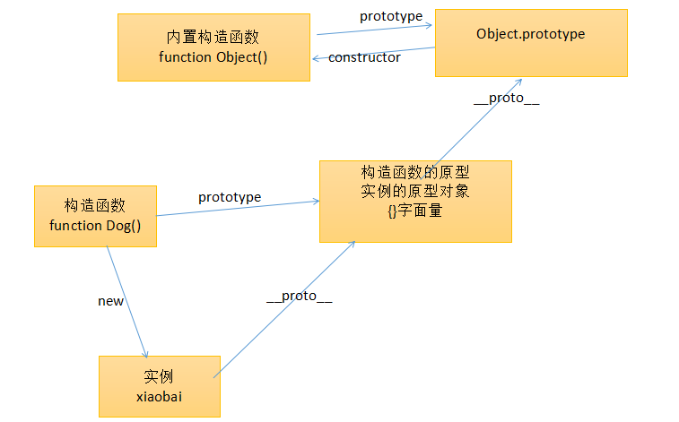

# 原型链
通过一层层链条式的寻找原型  

所有调用的对象的最原始的原型是 Object 的原型，是原型链的顶端  

# 数组的原型也是函数 
数组的原型函数是 Array.prototype  

最原始的原型也是 Object 的原型  

# 函数也是对象 
函数的原型是 Function.prototype  

最原始的原型也是 Object 的原型   

# 查看原型
.__proto__谷歌查看对象的原型    

.prototype函数查看原型通用   

# 继承
子集的原型继承父集的实例；  

  
